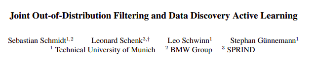

# Joint Out-of-Distribution Filtering and Data Discovery Active Learning
This is the offical implementation of "Joint Out-of-Distribution Filtering and Data Discovery Active Learning",
by Sebastian Schmidt, Leonard Schenk, Leo Schwinn and Stephan Günnemann presented at IEEE Conference on Computer Vision and Pattern Recognition (CVPR), 2025.



[Project Page](https://www.cs.cit.tum.de/daml/joda/)


## Installation

To install the required dependencies, run:

```bash
pip install -r requirements.txt
```
src needs to be in the python path such that joda_al can be imported.

## Structure

The subfolder provided the actual context 
```
src
├──joda_al
│   ├── Active_Learning_Cycles
│    # Different Cycle definition exceuting the Pool or Stream based scenarios
│   └── Config
│    # Defines the config and provides loading functionalities
│   └── Data_Loaders
│    #
│   └── metrics
│    #
│   ├── model_operations
│    #
│   ├── models
│    #
│   ├── Operation_Scenarios
│    #
│   ├── Pytorch_Extensions
│    #
│   ├── Selection_Methods
│    # Core of the Active learning selections. 
│   ├── task_supports
│    # Core handler to support the different tasks like classificiation, Semantic Segmentation or Object detection 
│   ├── tests
│    # 
│   ├── utils
│    #  ├── logging_utils
        ├── 
│   ├── Visualizations
│    #
```

## Usage


any config parameters can be given by cli or config file.
<br>
For detailed parameter and scenario descriptions, see [Joint Out-of-Distribution Filtering and Data Discovery Active Learning](doc/Method). <br>
For using the querys please refer to [HowToUseQueries](doc/HowToUseQueries.md).

Example usage of the active learning cycle:
```python
python start_active_learning.py --config_path <path_to_config> <optional further arguments>
```

## Citation
```bibtex
@InProceedings{Schmidt_2025_CVPR,
    author    = {Schmidt, Sebastian and Schenk, Leonard and Schwinn, Leo and G\"unnemann, Stephan},
    title     = {Joint Out-of-Distribution Filtering and Data Discovery Active Learning},
    booktitle = {Proceedings of the Computer Vision and Pattern Recognition Conference (CVPR)},
    month     = {June},
    year      = {2025},
    pages     = {25677-25687}
}
```